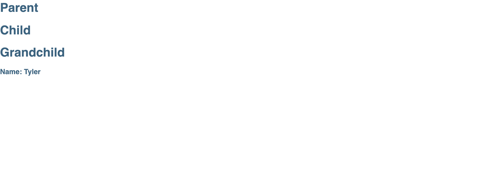

## Running the application
 - `npm install` - for getting the required libs  
 - `npm start` - for opening the application in browser

## About the application
Shows how to pass name property from parent to child to grandchild using react API context.

  

